# Mecanismele Genetice și Factorii de Risc în Boala Alzheimer: Căi Monogenice, Moștenire Oligogenică și Asocieri la Nivelul Genomic

## Autori și Coordonatori
- **Autori**: Szoke Mark-Andor, Andreea-Maria Cuth
## Prezentare Generală a Paradigmei Propuse
   - Boala Alzheimer este descrisă ca fiind cea mai comună formă de demență, având un impact profund asupra societății. Cercetarea vizează înțelegerea complexității genetice care contribuie la dezvoltarea bolii.
   - Paradigma propusă se concentrează pe explorarea căilor genetice monogenice și pe identificarea factorilor oligogenici, precum și pe utilizarea datelor de asociere la nivelul întregului genom pentru a descoperi noi ținte terapeutice.

## Descriere Arhitecturală Specifică
   - Documentul explorează implicațiile mutațiilor în genele APP, PSEN1 și PSEN2, care pot cauza forme monogenice de boala Alzheimer, transmiterea autosomal dominantă având un impact major asupra probabilității de apariție a bolii.
   - Analiza include și contribuția variațiilor oligogenice, care combină efectele multiplelor gene pentru a influența riscul de boală, precum și metode de corelare a acestor gene cu fenotipurile clinice.

## Configurarea Proiectului
   - Problema formulată se axează pe identificarea și analiza detaliată a variantelor genetice care contribuie la susceptibilitatea Alzheimer, cu un accent pe distincția între contribuțiile monogenice și cele oligogenice.
   - Datele folosite includ seturi de date genetice de la cohortele largi de pacienți, precum și date de secvențiere de înaltă rezoluție disponibile prin proiecte internaționale.
   - Tehnologiile implicate includ analize de secvențiere de nouă generație (NGS), metode bioinformatice avansate pentru analiza datelor genetice și sisteme de gestionare a bazelor de date biomedicale.

## Codul de Bază, Secvențe Importante

1. **Alzheimer_Research_Data_Processing**

### Încărcarea seturilor de date de antrenament și test
```python
df_train = pd.read_parquet('Data/train.parquet')
df_test = pd.read_parquet('Data/test.parquet')
```
Acest cod încarcă datele de antrenament și test din fișierele train.parquet și test.parquet. Aceste date sunt folosite pentru a antrena și evalua modelul de învățare automată.

### Definirea transformărilor pentru preprocesarea imaginilor
```python
transform = transforms.Compose([
    transforms.ToPILImage(),
    transforms.Resize((128, 128)),
    transforms.ToTensor(),
    transforms.Normalize(mean=[0.5], std=[0.5])
])
```
Acest fragment de cod configurează transformările aplicate imaginilor, inclusiv conversia la formatul PIL, redimensionarea, tensorizarea și normalizarea. Aceste prelucrări sunt esențiale pentru standardizarea datelor de intrare înainte de a le introduce în model.

### Definirea unui model CNN simplu pentru clasificarea imaginilor MRI
```python
class TinyCNN(nn.Module):
    def __init__(self):
        super(TinyCNN, self).__init__()
        self.conv1 = nn.Conv2d(1, 16, kernel_size=3, padding=1)
        self.pool = nn.MaxPool2d(2)
        self.fc = nn.Linear(16 * 64 * 64, 4)

    def forward(self, x):
        x = self.pool(F.relu(self.conv1(x)))
        x = x.view(-1, 16 * 64 * 64)
        x = self.fc(x)
        return x
```       
Modelul definit aici este un rețea neuronală convoluțională simplă, care include straturi convoluționale, de pooling și un strat fully connected, destinată clasificării imaginilor MRI în baza caracteristicilor detectate.

### Antrenarea modelului - Ciclul de antrenament pentru model
```python
for epoch in range(10):
    for images, labels in train_loader:
        images, labels = images.to(device), labels.to(device)
        optimizer.zero_grad()
        outputs = model(images)
        loss = criterion(outputs, labels)
        loss.backward()
        optimizer.step()
    print(f'Epoch {epoch+1}, Loss: {loss.item()}')
```       
Această secțiune de cod demonstrează ciclul de antrenament al modelului, folosind imagini și etichete din setul de date, și afișând pierderea pentru fiecare epocă, pentru a evalua progresul învățării modelului.

2. **10x_snRNASeq**

### Încărcarea și Prelucrarea Inițială a Datelor
```python
data = sc.read_10x_h5('data_path')
sc.pp.filter_cells(data, min_genes=200)
```
Această secțiune tratează importul datelor de snRNASeq și focalizarea pe structurile de date și explorarea inițială a datelor. Codul citește datele dintr-o locație specifică și afișează primele rânduri pentru a oferi o imagine de ansamblu asupra structurii setului de date.

### Preprocesarea Datelor
```python
sc.pp.normalize_total(data, target_sum=1e4)
sc.pp.log1p(data)
```
Datele sunt preprocesate pentru a filtra celulele bazate pe metrice de calitate, cum ar fi numărul de gene detectate. Acest lucru este esențial pentru menținerea calității datelor înalte și asigurarea faptului că analizele ulterioare sunt robuste și fiabile.

### Normalizarea și Selecția Caracteristicilor
```python
sc.pp.highly_variable_genes(data, min_mean=0.0125, max_mean=3, min_disp=0.5)
data = data[:, data.var.highly_variable]
```       
Tehnicile de normalizare sunt aplicate setului de date pentru a minimiza diferențele în nivelurile de expresie genică care ar putea apărea din adâncimi de secvențiere variabile între probe. 
De asemenea, sunt selectate caracteristici importante (gene) pe baza variabilității, ceea ce ajută la identificarea celor mai informative caracteristici pentru analiza ulterioară.

### Reducerea Dimensiunii
```python
sc.tl.pca(data, svd_solver='arpack')
sc.pp.neighbors(data, n_neighbors=10, n_pcs=40)
sc.tl.umap(data)
```       
Tehnici precum PCA (Analiza Componentelor Principale) și UMAP (Uniform Manifold Approximation and Projection) sunt utilizate pentru a reduce dimensiunile setului de date. 
Acest lucru simplifică complexitatea datelor, facilitând vizualizarea și identificarea modelelor sau grupurilor.

### Analiza Clustere
```python
sc.tl.louvain(data)
sc.pl.umap(data, color='louvain')
```       
Setul de date este grupat pentru a identifica grupuri de celule similare, care pot indica diferite tipuri de celule sau stări. 
Aceasta este o etapă esențială în analiza datelor snRNASeq, oferind perspective asupra compoziției celulare a probelor.

### Analiza Expresiei Diferențiale
```python
sc.tl.rank_genes_groups(data, 'louvain', method='t-test')
sc.pl.rank_genes_groups(data, n_genes=25, sharey=False)
```       
După grupare, se efectuează o analiză a expresiei diferențiale pentru a identifica genele care sunt semnificativ supra- sau sub-regulate între clustere. 
Acest lucru ajută la caracterizarea diferențelor biologice între tipurile de celule identificate sau condiții.

### Annotarea și Interpretarea
```python
data.obs['cell_type'] = data.obs['louvain'].map(cell_type_dict)
sc.pl.umap(data, color='cell_type')
```       
În final, clusterele sunt annotate pe baza markerilor genetici cunoscuți, iar rezultatele sunt interpretate pentru a trage concluzii biologice. 
Această etapă este crucială pentru a lega analiza computațională de semnificațiile și implicațiile biologice.

## Implementarea Aplicației
   - Se oferă capturi de ecran din software-urile utilizate pentru analize, demonstrând etapele de prelucrare a datelor și rezultatele obținute.

1. **Alzheimer_Research_Data_Processing**

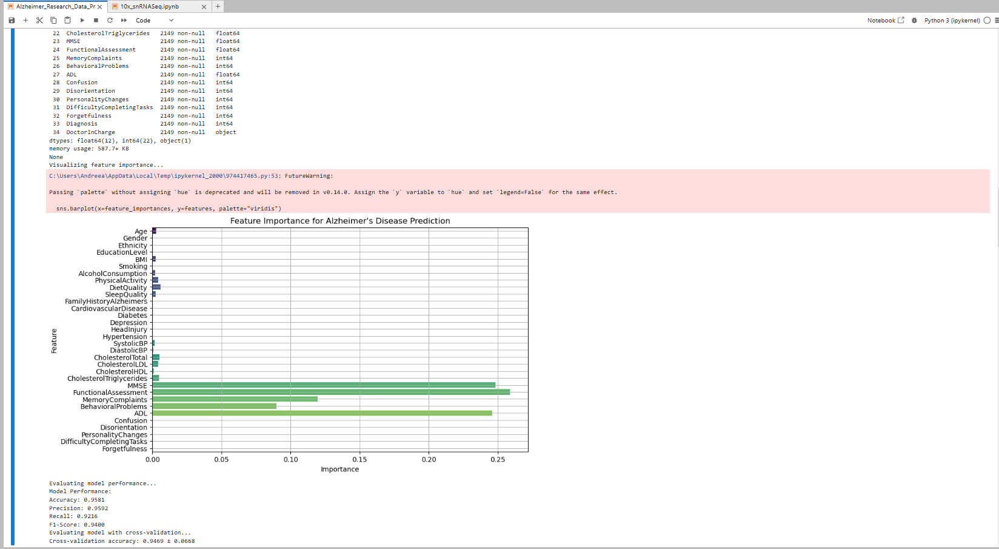
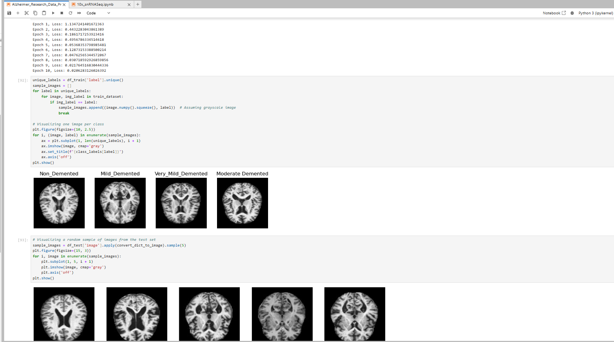
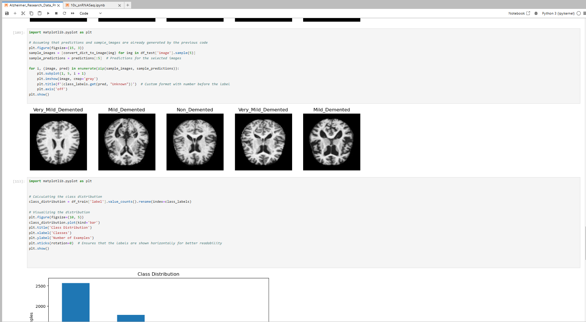
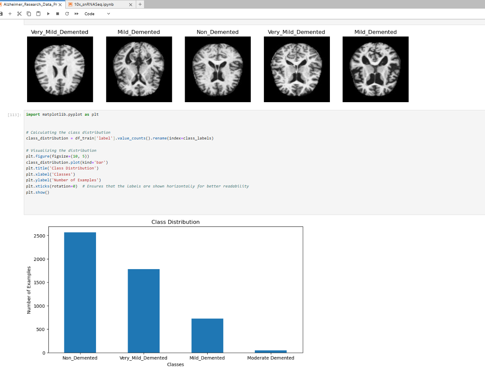


2. **10x_snRNASeq**


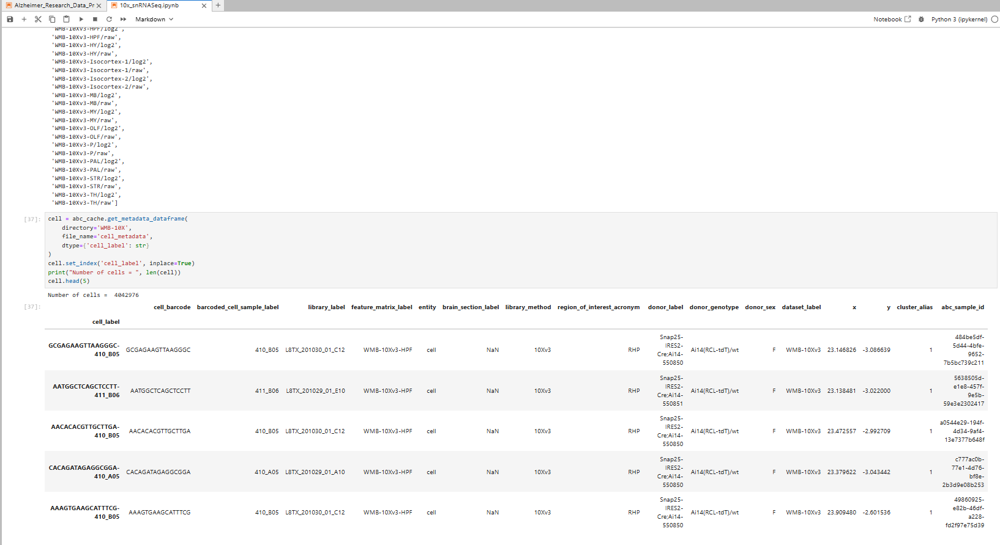
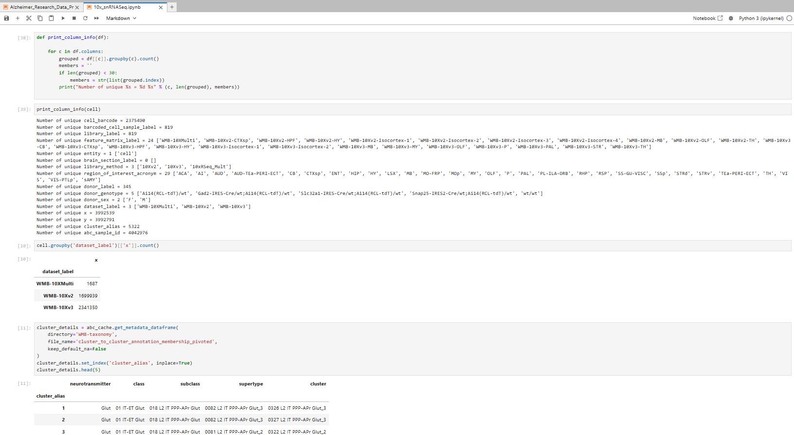
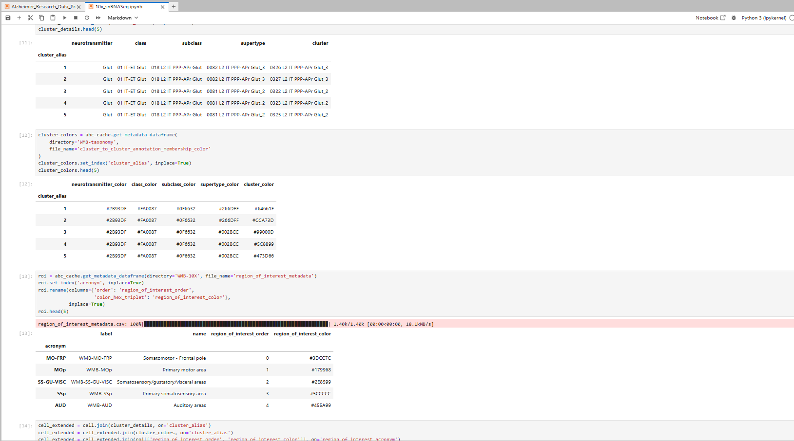
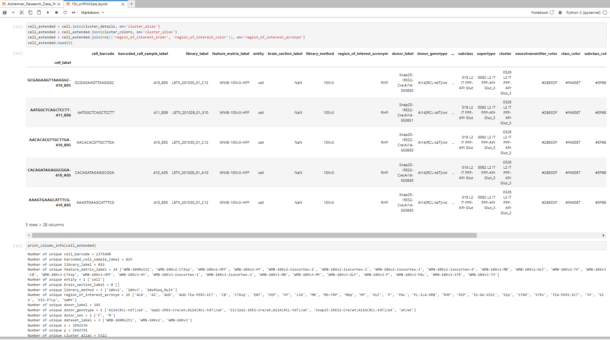
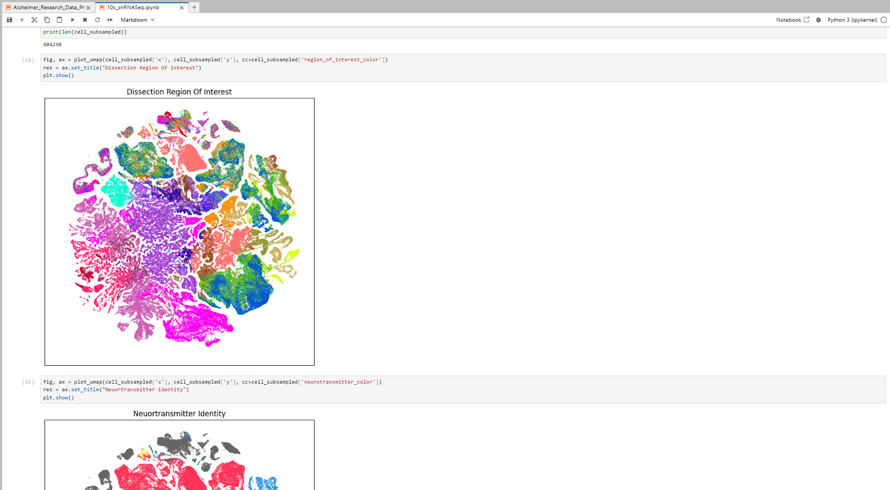
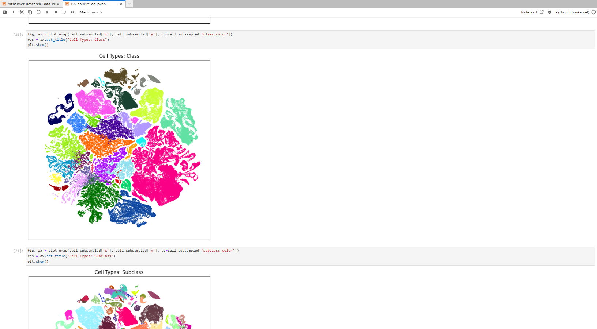
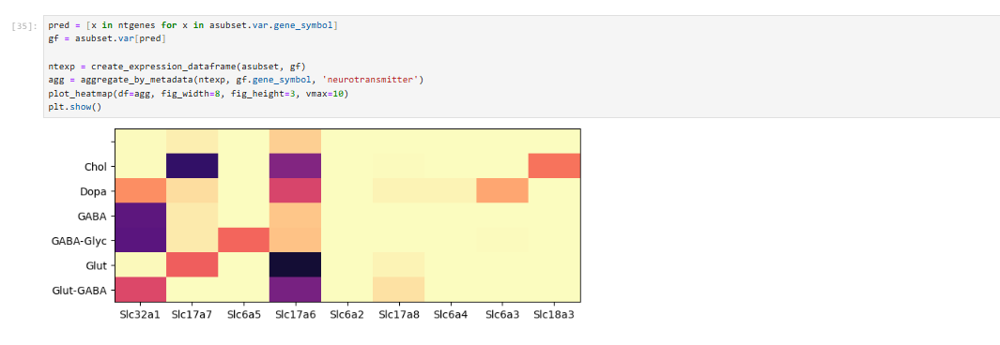


